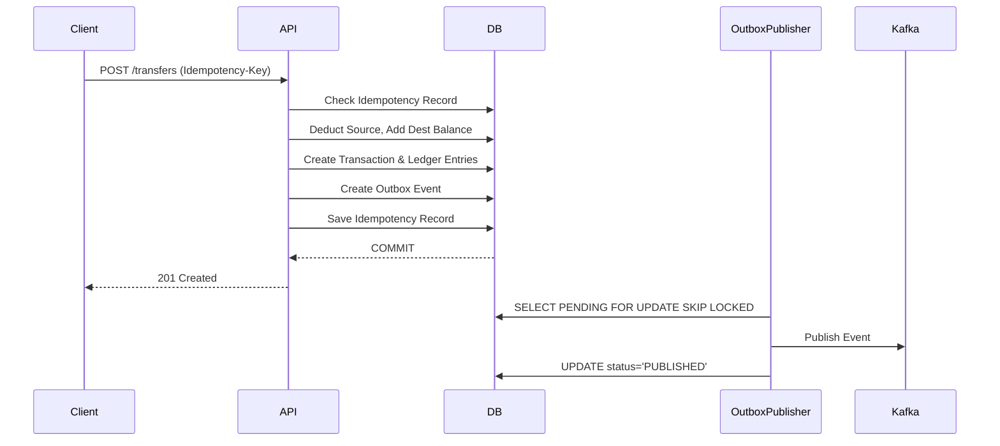

# High-Throughput Distributed Wallet & Ledger Platform

This repository implements a production-grade, high-throughput distributed wallet and financial ledger backend using Java and Spring Boot.

## Architecture at a Glance

At its core, this project demonstrates:

- **Double-Entry Ledger:** Ensures all transfers result in balanced DEBIT and CREDIT entries.
- **Transactional Outbox Pattern:** Ensures database updates and Kafka event publishing occur atomically.
- **Idempotency:** Protects against network retries and duplicated transactions.
- **Event-Driven Architecture:** Asynchronous notifications and downstream processing using Apache Kafka.
- **Performance:** Optimized using indexes, Testcontainers for robust verification, and k6 for load testing.



## Key Design Principles

- **Double-Entry Ledger:** The system maintains the invariant `SUM(CREDITS) - SUM(DEBITS) = 0`. No historical ledger entry is ever updated.
- **Concurrency Safety:** We use optimistic locking on the `Wallet` entity and database constraints to protect against double-spending.
- **Reliable Async Events:** Changes are persisted with the transactional outbox pattern before Kafka publication.

## Documentation

- [Architecture Overview](docs/architecture.md)
- [ADR-001](docs/ADR-001.md)
- [Project README](README.md)

## Infrastructure

The required infrastructure (PostgreSQL, Kafka, Redis, Prometheus, Grafana) is defined in `docker-compose.yml`.

To spin it up:

```bash
docker-compose up -d
```

## Running the Application

```bash
mvn clean install
mvn spring-boot:run
```

## Load Testing

You can run load tests using k6:

```bash
k6 run load-tests/transfers.js
```
