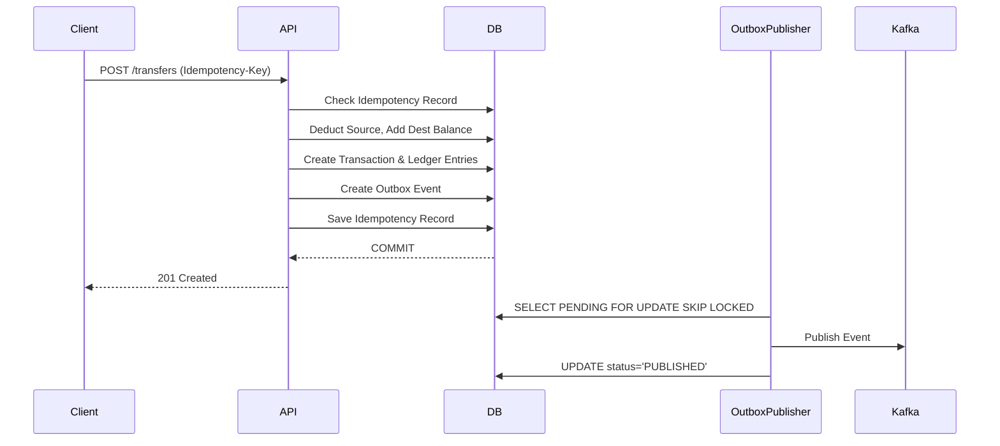

# Architecture Overview

## High-Level Flow

## Double-Entry Ledger
The system maintains the invariant `SUM(CREDITS) - SUM(DEBITS) = 0`. No historical ledger entry is ever updated.

## Concurrency
We use Optimistic Locking on the `Wallet` entity (via `@Version`) and DB constraints to protect against double spending.
